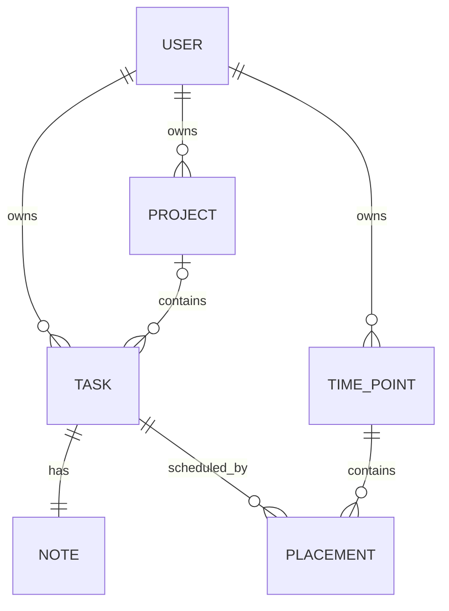
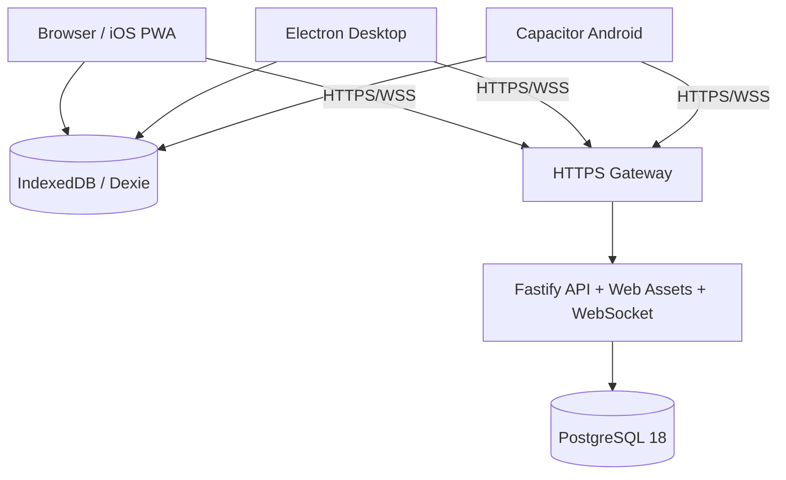

# DevTodo 完整开发规划

> 文档状态：实施基线 v1.0  
> 编写日期：2026-09-04  
> 适用目录：`/home/lvziw/项目/todo-list工具`  
> 产品定位：面向个人开发工作的、自托管、离线优先的任务工作台  
> 文档用途：作为后续开发对话的单一实施依据，而不是概念建议或功能愿望清单

## 1. 执行摘要

本项目应自行开发。现有 Todo 或项目管理产品通常把日期视为任务字段，或者把每日计划复制成新的任务；本项目的核心模型不同：

> 一个任务本体只存在一份，日期与“Codex 额度重置后”这类事件都只是任务的安排位置。

因此，`Task` 与 `Placement` 必须分离。把任务“复制到明天”表示为同一个任务新增一条明日安排；只有明确执行“复制任务”时，才创建新的任务记录。任务在任意页面完成后，所有安排位置必须同时显示完成状态。

V1 采用单用户、自托管架构：一个 Docker Compose 中枢提供 Web UI、REST API、增量同步、WebSocket 失效通知和 PostgreSQL 持久化；React Web UI 同时服务于浏览器、iOS PWA、Electron 桌面端和 Capacitor Android 端。Web UI 是唯一产品界面，Electron 与 Android 仅提供安全容器和少量平台能力。

V1 的五个一级产品概念固定为：

1. `Project`：开发项目。
2. `Task`：功能或杂项任务，具有全局唯一真实状态。
3. `TimePoint`：日期或用户定义的事件时间点。
4. `Placement`：任务与时间点之间的安排关系。
5. `Note`：任务的一对一 Markdown 开发备注。

“今日”“日历”“项目中的功能/杂项”“归档”“搜索”都只是上述概念的视图或属性，不增加新的核心对象。

## 2. 产品目标

### 2.1 主要目标

- 让个人开发者先建立长期任务库，再从任务库安排今天、未来日期或任意事件节点要处理的内容。
- 让项目功能、项目杂项和全局杂项处在同一套任务模型中，保持结构简单。
- 让任务备注承担轻量开发笔记的作用，可靠支持 Markdown、代码块、列表、链接和任务引用 ID。
- 在网络不稳定或中枢暂时离线时立即打开已有数据，并允许继续创建、编辑、完成和安排任务。
- 用一套响应式 Web UI 覆盖浏览器、iOS PWA、Electron 和 Android，避免四套界面分叉。
- 用 Docker Compose 完成可备份、可升级、可恢复的自托管部署。

### 2.2 成功标准

- 新任务可在当前页面通过一行输入完成捕获，不要求先填写完整表单。
- 一个任务可同时安排到两个日期和一个事件时间点，数据库中仍只有一个 `Task`。
- 在任一视图完成该任务后，其余所有视图在本地立即更新，并在其他在线客户端同步后更新。
- 离线创建的任务、备注和安排在恢复网络后不丢失、不重复，并可明确处理版本冲突。
- 中枢重启或升级不会丢失数据；备份与恢复流程经过实际演练。
- Web、PWA、桌面端和 Android 端使用同一套领域规则，不因容器不同产生不同数据语义。

### 2.3 产品原则

- 后端模型统一，前端表达符合人的直觉。
- 先捕获，再整理；创建任务不弹出大型表单。
- 任务状态与时间点状态完全独立。
- 默认归档而非删除，历史可搜索、可恢复。
- 低视觉噪声优先于装饰性效果。
- 离线能力是 V1 的数据架构要求，不是后期增加的缓存层。
- REST/同步协议是数据事实来源，WebSocket 只负责通知客户端“有变化可拉取”。
- 冲突必须可见且可恢复，不允许静默覆盖较新的备注。

## 3. 已锁定决策与默认假设

| 主题 | V1 决策 | 说明 |
|---|---|---|
| 使用者 | 单用户、单中枢 | 不做团队、成员、角色和共享项目；表中保留 `owner_id`，避免未来迁移困难 |
| 首次注册 | 一次性 Owner 初始化 | 必须同时提供环境变量中的 `BOOTSTRAP_TOKEN`，初始化后关闭公开注册 |
| 界面语言 | 简体中文优先 | 内部枚举、代码、API 字段使用英文 |
| 默认时区 | `Asia/Shanghai` | 可在设置中修改；日期安排使用用户本地日期，不用 UTC 日期代替 |
| 项目代号 | `DevTodo` | 展示名称可在正式发布前更换，不影响领域模型 |
| 任务状态 | `TODO`、`IN_PROGRESS`、`DONE` | 完成状态全局生效；允许重新打开 |
| 任务引用 ID | 服务器首次接收创建命令时事务分配 | 离线新任务显示“待同步分配”；不预分配容易冲突的客户端连续号段 |
| 任务分类 | `FEATURE`、`MISC` | 项目内可用两类；无项目的全局任务只能是 `MISC` |
| 时间点类型 | `DATE`、`EVENT` | `DATE` 保存绝对本地日期；`EVENT` 保存用户定义标题 |
| 事件状态 | 等待、已到达、已归档 | 由 `reached_at` 与 `archived_at` 推导，和任务完成度无关 |
| 任务备注 | 每个任务一份 Markdown Note | Note 独立版本控制，降低标题/状态更新与长备注编辑互相冲突的概率 |
| 日期语义 | 安排日期，不是截止日期 | V1 不提供 deadline/due date，避免概念混淆 |
| “复制到” | 新建 Placement | 不复制 Task；若目标已有安排则幂等跳过 |
| “移动到” | 原子转移 Placement | 同一事务内创建目标安排并移除来源安排 |
| “复制任务” | 新建 Task | 新引用 ID、状态重置为 `TODO`，复制标题、分类、项目、优先级和备注，不复制安排 |
| 数据同步 | 增量 change feed + 客户端 outbox | 不引入 CRDT；使用版本号、幂等 mutation ID 和显式冲突处理 |
| Web 实时性 | WebSocket 失效通知 | WebSocket 断开时由前台轮询、窗口聚焦和网络恢复触发拉取兜底 |
| 桌面端 | Electron，加载打包后的本地 Web 资源 | 禁止启用 Node integration，禁止从中枢加载可执行前端代码 |
| Android | Capacitor 容器 | 与 Web 共用构建产物和领域逻辑；不另写一套原生 UI |
| iOS | PWA 安装 | V1 不交付 iOS App Store 原生包 |
| 删除 | 主界面只提供归档与恢复 | 内部保留同步 tombstone；V1 不提供不可恢复的批量硬删除 UI |

## 4. 范围定义

### 4.1 V1 必须交付

#### 账户与设置

- 一次性 Owner 初始化、登录、刷新会话、退出和设备会话撤销。
- 用户时区、每周起始日、默认新任务位置和界面偏好。
- 在线、离线、同步中、同步失败和存在冲突的明确状态。

#### 项目与任务库

- 项目创建、改名、排序、归档和恢复。
- 项目内固定“功能”“杂项”两组任务。
- 全局“杂项”任务区。
- 任务快速创建、详情编辑、状态切换、优先级、排序、归档、恢复和复制任务。
- 稳定任务引用 ID，例如 `DSH-32` 与 `MISC-18`。
- Markdown 备注编辑与安全渲染，支持代码块、列表、复选列表、链接及引用 ID 跳转。
- 所有任务、已完成、归档和全文搜索视图。

#### 时间与安排

- 今日首页。
- 月日历与选中日期任务列表。
- 自定义事件时间点创建、改名、排序、标记到达、归档和恢复。
- 从任务库搜索并把已有任务安排到日期或事件。
- 拖拽添加、移动和排序；移动端提供等价的长按与 Bottom Sheet 操作。
- 明确区分“复制到”“移动到”“从此处移除”“复制任务”。
- 将某日未完成任务批量复制到下一天，跳过重复安排，并提供短时撤销。

#### 多端与离线

- 浏览器响应式 Web UI。
- 可安装 PWA，iOS Safari 可“添加到主屏幕”。
- IndexedDB 本地数据库、离线读写、outbox、增量拉取、全量重同步和冲突处理。
- Electron 桌面包，含全局快速添加快捷键。
- Capacitor Android 包，处理返回键、网络变化、应用前后台和安全令牌存储。

#### 中枢与运维

- Docker Compose 部署应用、PostgreSQL 和 HTTPS 网关。
- 显式数据库迁移、健康检查、结构化日志和请求 ID。
- PostgreSQL 备份、校验与恢复文档，并完成一次真实恢复演练。
- OpenAPI 文档、部署文档、同步协议文档、安全说明和测试报告。

### 4.2 V1 明确不做

- 多用户协作、团队空间、评论、指派人、角色权限和公开分享。
- Sprint、Epic、Story、工时、燃尽图、甘特图和复杂依赖关系。
- 重复任务、提醒、推送通知、邮件通知和日历订阅。
- GitHub、GitLab、Codex 或其他外部服务自动触发时间点。
- 附件、图片上传、对象存储和富文本 WYSIWYG 编辑器。
- 原生 iOS 应用、Apple App Store 发布和 Apple Watch 客户端。
- 端到端加密、本地 PIN 锁和跨用户密钥共享。
- 自定义任务分类、无限层级子任务、标签体系和自定义字段。
- 自动更新服务；V1 桌面端采用有校验和的手动更新包。

### 4.3 V1.1 候选能力

- 标签和保存的筛选器。
- 一级子任务，但仍复用 `Task`，不创建独立“功能”对象。
- 截止日期，必须作为独立于 Placement 的字段与提醒语义设计。
- 事件时间点自动触发器。
- 桌面端自动更新与正式代码签名流程。
- Android 本地通知与共享菜单快速添加。
- 加密导出、导入和用户可见的回收站清理策略。

## 5. 领域模型与不可破坏的规则

### 5.1 领域关系



### 5.2 核心不变量

1. 一个任务无论出现在多少个视图和时间点，都只有一个 `Task.id` 和一个真实 `Task.status`。
2. 同一任务在同一时间点最多有一条未删除的 Placement。
3. 完成任务不得自动删除 Placement，也不得改变 Event 的到达状态。
4. Event 到达或归档不得自动完成、重新打开或移动其中的 Task。
5. 日期时间点只能由 `local_date` 表示；“今天”“明天”是 UI 按用户时区计算出的标签，不能持久化为标题。
6. 全局杂项任务必须满足 `project_id IS NULL` 且 `category = MISC`。
7. 项目内任务必须有 `project_id`，分类只能是 `FEATURE` 或 `MISC`。
8. 复制到日期或事件只新增 Placement；复制任务才新增 Task 和 Note。
9. 所有客户端写操作都必须携带唯一 mutation ID；服务器重复接收同一 mutation 时返回相同结果，不重复执行副作用。
10. 更新 Task、Note、Project、TimePoint 或 Placement 时必须检查 `base_version`；不允许静默覆盖服务器上的新版本。
11. 所有领域写入、版本递增和 change feed 记录必须位于同一个数据库事务。
12. 归档只影响默认可见性，不破坏任务、备注、安排和历史引用。

### 5.3 状态机

#### Task

```text
TODO <-> IN_PROGRESS <-> DONE
TODO <-> DONE
```

- 进入 `DONE` 时写入 `completed_at`。
- 从 `DONE` 重新打开时清空 `completed_at`。
- `archived_at` 是与状态独立的可见性字段。

#### Event TimePoint

```text
WAITING --mark reached--> REACHED
WAITING --archive-------> ARCHIVED
REACHED --archive-------> ARCHIVED
ARCHIVED --restore------> WAITING or REACHED
```

- 数据库不保存冗余状态枚举：`archived_at != null` 表示 `ARCHIVED`；否则 `reached_at != null` 表示 `REACHED`；两者都为空表示 `WAITING`。
- 恢复归档只清空 `archived_at`，因此可恢复到归档前的等待或已到达状态。
- Date TimePoint 不使用上述状态机。

### 5.4 Placement 操作语义

| 用户动作 | 数据行为 | 来源是否保留 | Task 是否新增 |
|---|---|---:|---:|
| 从任务库拖入时间点 | 新建 Placement | 不适用 | 否 |
| 从一个时间点拖到另一个 | 原子移动 Placement | 否 | 否 |
| 选择“复制到” | 在目标新建 Placement | 是 | 否 |
| 选择“从此处移除” | 软删除当前 Placement | 其他位置保留 | 否 |
| 选择“复制任务” | 新建 Task、Note 和引用 ID | 原任务保留 | 是 |
| 批量复制未完成任务到次日 | 对每个未完成 Task 幂等新增 Placement | 是 | 否 |

## 6. 数据库设计

### 6.1 通用约定

- 数据库使用 PostgreSQL 18，镜像固定到受支持的 18.x 补丁版本和镜像摘要。
- 主键使用由应用生成的 UUIDv7，允许客户端离线创建实体。
- 所有用户数据表包含 `owner_id`，服务层和数据库查询都必须限定 Owner。
- 可同步实体包含 `version INTEGER NOT NULL DEFAULT 1`、`created_at TIMESTAMPTZ`、`updated_at TIMESTAMPTZ` 和 `deleted_at TIMESTAMPTZ NULL`。
- API 中时间戳使用 UTC RFC 3339；日期安排使用 `YYYY-MM-DD` 本地日期字符串。
- 排序字段使用有间隔的 `BIGINT rank`。默认步长为 1024；间距耗尽时仅在当前列表事务内重排。
- 所有软删除实体都产生 tombstone change；客户端不能通过普通资源接口读取其他 Owner 数据。

### 6.2 业务表

#### `users`

| 字段 | 类型 | 约束/用途 |
|---|---|---|
| `id` | UUID | 主键 |
| `username` | VARCHAR(64) | 规范化后唯一 |
| `password_hash` | TEXT | Argon2id 哈希 |
| `created_at` | TIMESTAMPTZ | 创建时间 |
| `updated_at` | TIMESTAMPTZ | 修改时间 |
| `disabled_at` | TIMESTAMPTZ NULL | 禁用账户 |

#### `user_settings`

| 字段 | 类型 | 约束/用途 |
|---|---|---|
| `owner_id` | UUID | 主键、外键 |
| `timezone` | TEXT | 默认 `Asia/Shanghai`，必须是有效 IANA 时区 |
| `week_starts_on` | SMALLINT | 1 表示周一，0 表示周日 |
| `default_capture_target` | TEXT | `GLOBAL_MISC` 或最近上下文 |
| `version` | INTEGER | 并发控制 |
| `updated_at` | TIMESTAMPTZ | 修改时间 |

#### `projects`

| 字段 | 类型 | 约束/用途 |
|---|---|---|
| `id` | UUID | 主键 |
| `owner_id` | UUID | 外键 |
| `name` | VARCHAR(160) | 去除首尾空白后非空 |
| `task_prefix` | VARCHAR(10) | 2 至 10 位大写字母或数字，以字母开头，Owner 内唯一 |
| `next_task_number` | INTEGER | 事务内递增，初始 1 |
| `rank` | BIGINT | 侧栏排序 |
| `archived_at` | TIMESTAMPTZ NULL | 项目归档 |
| 通用字段 |  | `version`、创建、更新、软删除时间 |

- 创建首个任务后，`task_prefix` 在 V1 UI 中不可修改，以保证引用 ID 稳定。
- 项目归档不级联更改任务状态或 Placement。

#### `tasks`

| 字段 | 类型 | 约束/用途 |
|---|---|---|
| `id` | UUID | 主键，允许客户端生成 |
| `owner_id` | UUID | 外键 |
| `project_id` | UUID NULL | 空值表示全局杂项 |
| `category` | ENUM/TEXT | `FEATURE` 或 `MISC` |
| `reference_id` | VARCHAR(32) | Owner 内唯一且创建后不可变 |
| `title` | VARCHAR(500) | 去除首尾空白后非空 |
| `status` | ENUM/TEXT | `TODO`、`IN_PROGRESS`、`DONE` |
| `priority` | ENUM/TEXT | `NONE`、`LOW`、`MEDIUM`、`HIGH` |
| `rank` | BIGINT | 项目分类或全局杂项中的顺序 |
| `completed_at` | TIMESTAMPTZ NULL | 完成时间 |
| `archived_at` | TIMESTAMPTZ NULL | 任务归档 |
| 通用字段 |  | `version`、创建、更新、软删除时间 |

- `reference_id` 由项目前缀或 `MISC` 加服务器事务分配的序号生成。服务器中的 Task 一经创建就必须有引用 ID。
- 离线客户端先用 UUID 作为稳定实体身份，并在本地把 `referenceId` 记为 `null`；首次 push 成功后使用服务器返回的 `DSH-n` 或 `MISC-n` 更新本地记录。这样既允许离线创建，也不会让两个离线设备分配相同连续号。
- 服务层与数据库 CHECK/触发约束共同保证全局杂项和项目分类规则。

#### `notes`

| 字段 | 类型 | 约束/用途 |
|---|---|---|
| `id` | UUID | 主键 |
| `owner_id` | UUID | 外键 |
| `task_id` | UUID | 唯一外键，一个 Task 一份 Note |
| `content_markdown` | TEXT | 原始 Markdown，默认空字符串 |
| 通用字段 |  | 独立 `version`、创建、更新、软删除时间 |

- Task 创建事务必须同时创建空 Note。
- 渲染时禁止执行原始 HTML、脚本、事件属性和危险 URL scheme。

#### `time_points`

| 字段 | 类型 | 约束/用途 |
|---|---|---|
| `id` | UUID | 主键 |
| `owner_id` | UUID | 外键 |
| `type` | ENUM/TEXT | `DATE` 或 `EVENT` |
| `local_date` | DATE NULL | 仅 DATE 使用 |
| `title` | VARCHAR(200) NULL | 仅 EVENT 使用，去空白后非空 |
| `rank` | BIGINT | Event 列表内排序；Date 不依赖此字段 |
| `reached_at` | TIMESTAMPTZ NULL | Event 到达时间 |
| `archived_at` | TIMESTAMPTZ NULL | Event 归档时间 |
| 通用字段 |  | `version`、创建、更新、软删除时间 |

- DATE 必须有 `local_date` 且没有 `title`；EVENT 必须有 `title` 且没有 `local_date`。
- 每个 Owner 对每个 `local_date` 只能有一个未删除 DATE TimePoint。
- 日期 TimePoint 按需创建，不预先生成整年记录。

#### `placements`

| 字段 | 类型 | 约束/用途 |
|---|---|---|
| `id` | UUID | 主键 |
| `owner_id` | UUID | 外键 |
| `task_id` | UUID | 外键 |
| `time_point_id` | UUID | 外键 |
| `rank` | BIGINT | 该时间点中的顺序 |
| 通用字段 |  | `version`、创建、更新、软删除时间 |

- 使用部分唯一索引约束同一 Task 与 TimePoint 最多一条 `deleted_at IS NULL` 的 Placement。
- Task 或 TimePoint 归档时不删除 Placement。

### 6.3 同步与认证支持表

#### `devices`

- `id UUID`、`owner_id UUID`、`name`、`platform`、`last_seen_at`、`created_at`、`revoked_at`。
- 客户端首次登录创建稳定设备 ID；设置页可撤销设备会话。

#### `refresh_sessions`

- 保存 refresh token 的不可逆哈希、设备 ID、过期时间、轮换链和撤销时间。
- 服务器从不保存可直接使用的 refresh token 明文。

#### `client_mutations`

- 主键为 `(owner_id, client_id, mutation_id)`。
- 保存请求摘要、处理结果摘要、首次处理时间和到期时间。
- 默认保留 90 天，用于重复提交幂等处理。

#### `sync_changes`

- `seq BIGSERIAL` 作为单调游标。
- 字段包含 `owner_id`、`entity_type`、`entity_id`、`entity_version`、`operation`、完整实体快照或 tombstone、`committed_at`。
- 默认保留 90 天；游标早于保留窗口时返回 `SYNC_CURSOR_EXPIRED`，客户端执行安全全量重同步。

### 6.4 必要索引

- `projects(owner_id, archived_at, rank)`。
- `tasks(owner_id, project_id, category, archived_at, status, rank)`。
- `tasks(owner_id, reference_id)` 唯一索引。
- `notes(owner_id, task_id)` 唯一索引。
- `time_points(owner_id, type, local_date)` 和 Event 状态相关索引。
- `placements(owner_id, time_point_id, rank)`。
- `placements(task_id, time_point_id) WHERE deleted_at IS NULL` 唯一索引。
- `sync_changes(owner_id, seq)`。
- 标题、引用 ID、项目名和备注搜索采用 PostgreSQL `pg_trgm` GIN 索引；迁移中显式启用扩展。

## 7. 系统架构

### 7.1 运行时拓扑



### 7.2 技术栈基线

| 层 | 选择 | 约束 |
|---|---|---|
| JavaScript 运行时 | Node.js 24 LTS | 根目录固定版本；CI、容器和本地开发一致 |
| 语言 | TypeScript strict | 禁止关闭 strict；外部输入必须运行时校验 |
| 包管理 | pnpm workspace | 在 `packageManager` 字段和 lockfile 固定实际版本 |
| Web | React + Vite | SPA，无 SSR；当前稳定兼容版本锁入 lockfile |
| 路由 | React Router | URL 可深链到项目、日期、事件和任务详情 |
| UI 基础 | CSS Modules + CSS variables + headless primitives | 不引入预制视觉主题；组件样式由本项目设计系统控制 |
| 图标 | Lucide | 单色线框，统一尺寸与 stroke |
| 拖拽 | dnd-kit | 支持鼠标、触摸和键盘传感器 |
| 本地数据 | IndexedDB + Dexie | UI 主要读取本地数据库，网络同步写入本地库 |
| PWA | Workbox 集成的 Vite PWA 插件 | 缓存应用壳；数据不放入 Cache Storage |
| API | Fastify | JSON Schema/OpenAPI、结构化日志、WebSocket 插件 |
| 运行时契约 | Zod | 前后端共享 DTO、环境变量和 mutation 校验 |
| 数据访问 | Drizzle ORM + SQL migration | 禁止运行时自动改表；复杂约束使用显式 SQL migration |
| 数据库 | PostgreSQL 18 | 固定 18.x 补丁版本；数据库端口默认不暴露到宿主公网 |
| 桌面 | Electron + Electron Forge | 本地打包 Web 资源；安全 preload 暴露最小能力 |
| Android | Capacitor 8 | 使用同一 Web 构建；平台能力通过适配器注入 |
| 单元测试 | Vitest + Testing Library | 领域、同步和组件行为 |
| 端到端 | Playwright | Web、多浏览器上下文和 Electron 核心流程 |
| 集成测试 | Testcontainers/PostgreSQL | 使用真实 PostgreSQL 验证迁移、事务和约束 |

所有三方依赖在 M0 初始化时选择互相兼容的稳定版本，提交精确 lockfile。后续升级按独立变更处理，不在功能提交中顺带升级大版本。

### 7.3 仓库结构

```text
todo-list工具/
├── apps/
│   ├── api/                 # Fastify API、WebSocket、静态 Web 托管
│   ├── web/                 # React SPA 与 PWA
│   ├── desktop/             # Electron main/preload/打包配置
│   └── mobile/              # Capacitor Android 工程与平台适配
├── packages/
│   ├── contracts/           # Zod DTO、mutation、错误码和共享枚举
│   ├── database/            # Drizzle schema、SQL migrations、seed
│   ├── domain/              # 无框架领域规则与命令处理
│   ├── sync-client/         # Dexie schema、outbox、pull/push、冲突模型
│   ├── ui/                  # 设计 token 与共享界面组件
│   └── config/              # TypeScript、ESLint、Vitest 共享配置
├── infra/
│   ├── caddy/               # HTTPS 网关配置
│   └── docker/              # 应用镜像与启动脚本
├── docs/
│   ├── ARCHITECTURE.md
│   ├── API.md
│   ├── SYNC_PROTOCOL.md
│   ├── DEPLOYMENT.md
│   ├── BACKUP_RESTORE.md
│   ├── SECURITY.md
│   └── TEST_REPORT.md
├── compose.yaml
├── compose.dev.yaml
├── pnpm-workspace.yaml
├── package.json
├── README.md
└── DEVELOPMENT_PLAN.md
```

不引入 Turborepo 或 Nx。V1 的包数量和构建关系可由 pnpm workspace 与根脚本清楚管理，避免新增一层构建系统复杂度。

### 7.4 服务端模块边界

- `auth`：初始化、登录、token 轮换、设备与会话撤销。
- `projects`：项目生命周期、前缀与排序。
- `tasks`：任务状态、引用 ID、复制和归档。
- `notes`：独立版本的 Markdown 内容。
- `time-points`：日期按需创建、Event 生命周期和排序。
- `placements`：添加、移动、复制、移除、排序和批量 rollover。
- `search`：Owner 范围内的任务、项目和 Note 搜索。
- `sync`：mutation 幂等执行、change feed、snapshot 和游标过期。
- `realtime`：认证 WebSocket 与 `sync.required` 通知。
- `operations`：健康检查、版本信息、日志和迁移状态。

路由层只负责认证、校验和响应映射；领域规则位于 `packages/domain`；事务编排与 change feed 写入位于应用服务，不散落在路由或 ORM hook 中。

## 8. API 与契约

### 8.1 通用约定

- API 前缀为 `/api/v1`，WebSocket 为 `/api/v1/ws`。
- JSON 字段使用 `camelCase`，数据库字段使用 `snake_case`。
- 所有响应带 `X-Request-Id`；客户端也可提供合法 UUID 请求 ID。
- 列表采用游标分页，不使用会在并发写入时漂移的页码分页。
- 所有写请求必须提供 `Idempotency-Key`；离线同步请求内每个 mutation 另有 `mutationId`。
- 更新和删除携带 `baseVersion`。冲突返回 HTTP 409 和服务器当前快照。
- 错误体固定为 `{ code, message, requestId, details }`；`message` 可展示，`code` 用于程序分支。
- OpenAPI 文件由路由 schema 生成并在 CI 中检查是否与提交版本一致。

### 8.2 核心 DTO

```ts
type TaskStatus = 'TODO' | 'IN_PROGRESS' | 'DONE';
type TaskCategory = 'FEATURE' | 'MISC';
type TaskPriority = 'NONE' | 'LOW' | 'MEDIUM' | 'HIGH';
type TimePointType = 'DATE' | 'EVENT';

interface TaskDto {
  id: string;
  referenceId: string;
  projectId: string | null;
  category: TaskCategory;
  title: string;
  status: TaskStatus;
  priority: TaskPriority;
  rank: string;
  version: number;
  completedAt: string | null;
  archivedAt: string | null;
  createdAt: string;
  updatedAt: string;
}

interface NoteDto {
  id: string;
  taskId: string;
  contentMarkdown: string;
  version: number;
  updatedAt: string;
}

interface TimePointDto {
  id: string;
  type: TimePointType;
  localDate: string | null;
  title: string | null;
  rank: string;
  version: number;
  reachedAt: string | null;
  archivedAt: string | null;
  createdAt: string;
  updatedAt: string;
}

interface PlacementDto {
  id: string;
  taskId: string;
  timePointId: string;
  rank: string;
  version: number;
  createdAt: string;
  updatedAt: string;
}
```

`rank` 以十进制字符串传输，避免 JavaScript 对 PostgreSQL `BIGINT` 的精度问题。

服务器返回的 `TaskDto.referenceId` 始终为字符串；客户端 Dexie 使用单独的 `LocalTask` 类型，把尚未 push 的新任务表示为 `referenceId: string | null`。界面在该短暂阶段显示“待同步分配”，任务路由和内部引用始终使用 UUID。

### 8.3 资源端点

#### 初始化与认证

- `GET /bootstrap/status`：返回是否已创建 Owner，不泄露用户名。
- `POST /bootstrap`：使用 `BOOTSTRAP_TOKEN` 一次性创建 Owner；数据库事务和唯一锁防止并发抢注。
- `POST /auth/login`：验证密码并创建设备会话。
- `POST /auth/refresh`：轮换 refresh token，检测 token 重放。
- `POST /auth/logout`：撤销当前 refresh session。
- `GET /me`：返回当前用户、设置与服务能力。
- `GET /devices`、`DELETE /devices/:id`：查看和撤销其他设备。

#### Project

- `GET /projects`
- `POST /projects`
- `GET /projects/:id`
- `PATCH /projects/:id`
- `POST /projects/:id/archive`
- `POST /projects/:id/restore`
- `POST /projects/reorder`

#### Task 与 Note

- `GET /tasks`：支持项目、分类、状态、归档和时间点过滤。
- `POST /tasks`
- `GET /tasks/:id`
- `PATCH /tasks/:id`
- `POST /tasks/:id/archive`
- `POST /tasks/:id/restore`
- `POST /tasks/:id/duplicate`
- `PUT /tasks/:id/note`
- `GET /search/tasks?q=`：搜索标题、引用 ID、项目名和备注。

#### TimePoint

- `GET /time-points?type=DATE|EVENT`
- `POST /time-points/date`：按本地日期获取或创建，重复请求返回同一实体。
- `POST /time-points/events`
- `PATCH /time-points/:id`
- `POST /time-points/:id/reach`
- `POST /time-points/:id/archive`
- `POST /time-points/:id/restore`
- `POST /time-points/events/reorder`

#### Placement

- `GET /time-points/:id/placements`
- `POST /placements`：把 Task 安排到 TimePoint，重复关系返回现有 Placement。
- `DELETE /placements/:id`：从当前位置移除，不删除 Task。
- `POST /placements/:id/move`
- `POST /placements/:id/copy`
- `POST /time-points/:id/placements/reorder`
- `POST /dates/:localDate/rollover`：把未完成任务安排到下一本地日期，返回 `createdIds` 与 `skippedTaskIds`。
- `POST /rollovers/:operationId/undo`：只撤销该次 rollover 新建且未被后续改动的 Placement。

#### 同步

- `GET /sync/snapshot`：分页返回当前 Owner 的完整实体快照和快照游标。
- `GET /sync/pull?cursor=&limit=`：返回游标之后的 change batch。
- `POST /sync/push`：批量提交本地 mutations，逐条返回 applied、conflict 或 rejected。
- `GET /sync/status`：返回服务器当前游标、最旧可用游标与协议版本。

### 8.4 必须稳定的错误码

- `AUTH_REQUIRED`
- `AUTH_INVALID_CREDENTIALS`
- `AUTH_SESSION_REVOKED`
- `BOOTSTRAP_ALREADY_COMPLETED`
- `BOOTSTRAP_TOKEN_INVALID`
- `VALIDATION_FAILED`
- `ENTITY_NOT_FOUND`
- `ENTITY_ARCHIVED`
- `VERSION_CONFLICT`
- `PLACEMENT_ALREADY_EXISTS`
- `INVALID_STATE_TRANSITION`
- `SYNC_CURSOR_EXPIRED`
- `SYNC_PROTOCOL_UNSUPPORTED`
- `MUTATION_REJECTED`
- `RATE_LIMITED`
- `INTERNAL_ERROR`

客户端不得根据英文错误文本判断逻辑。

## 9. 离线优先与同步协议

### 9.1 客户端本地数据库

Dexie 数据库按 `hub origin + owner id` 隔离，至少包含以下 stores：

- `projects`
- `tasks`
- `notes`
- `timePoints`
- `placements`
- `settings`
- `outbox`
- `conflicts`
- `syncMeta`

UI 的列表和详情主要从 Dexie reactive query 读取。在线 REST 响应与 pull change 必须先写入 Dexie，再由 UI 自动更新，避免网络状态与本地状态形成两套事实来源。

### 9.2 启动流程

1. 加载本地应用壳和本地数据库。
2. 若本地存在已初始化快照，立即渲染任务；无需等待服务器。
3. 恢复 refresh session；离线时保留本地工作能力并显示“离线”。
4. 有网络且认证成功后，先 push outbox，再从已确认 cursor 执行 pull。
5. 应用前台期间连接 WebSocket；收到 `sync.required` 后触发 pull。
6. WebSocket 不可用时，每 30 秒、窗口重新聚焦、浏览器 `online` 事件和移动端回到前台时触发同步。

### 9.3 本地写入流程

1. 客户端生成实体 UUIDv7 和 mutation UUID。离线新 Task 暂无连续引用 ID；该 ID 由服务器应用 `task.create` 时分配。
2. 在一个 IndexedDB 事务中乐观更新本地实体，并把 mutation 加入 outbox。
3. UI 立即显示结果，并用非干扰状态标记“待同步”。
4. 同步器按同一客户端的创建顺序提交 mutations；独立实体可组成有限批次。
5. 服务器在数据库事务中检查幂等记录和 `baseVersion`，写业务数据、版本和 change feed。
6. 客户端收到 applied 后更新服务器版本、服务器分配的任务引用 ID，并移除 outbox 项。
7. 网络错误采用带抖动的指数退避；认证错误暂停 outbox 并请求重新登录；验证错误进入可见失败队列。

### 9.4 Push 契约示例

```json
{
  "protocolVersion": 1,
  "clientId": "0199a5c0-2d33-7b61-82c4-0f52a503d441",
  "mutations": [
    {
      "mutationId": "0199a5c1-1140-7e88-9ed8-93e9c179e321",
      "command": "task.update",
      "entityId": "0199a5bf-bef4-75ee-81e2-105644617142",
      "baseVersion": 4,
      "occurredAt": "2026-09-04T10:30:00.000+08:00",
      "payload": {
        "status": "DONE"
      }
    }
  ]
}
```

服务器响应对每条 mutation 返回独立状态；批次传输不意味着整个批次必须一起成功。需要原子性的业务操作，如 Placement move，在单个 command 内事务执行。

### 9.5 Pull 与快照

- `cursor` 是不透明十进制序号字符串，客户端只能保存和回传，不能自行计算。
- pull 按提交顺序返回完整实体快照或 tombstone。
- 客户端在一个 IndexedDB 事务中应用整个 batch，并仅在成功后推进 cursor。
- 首次登录使用 snapshot；snapshot 读取使用数据库一致性快照，结束时返回与其一致的 change cursor。
- 若 cursor 过期，客户端保留 outbox 和冲突记录，下载新 snapshot，再按原顺序重放尚未确认的本地 mutations。

### 9.6 冲突策略

- 服务器版本不等于 mutation 的 `baseVersion` 时，返回 `VERSION_CONFLICT` 和服务器当前实体。
- 客户端保留本地意图，不覆盖本地草稿，也不自动覆盖服务器。
- Note 冲突界面并排展示“本地版本”和“服务器版本”，提供“采用本地内容”“采用服务器内容”“合并后保存”。
- Task/Project/TimePoint 字段冲突展示变更字段、服务器值和本地值，用户确认后以服务器最新版本生成新 mutation。
- Placement 已存在视为幂等成功；来源已移除的重复 move 返回先前 mutation 结果。
- 被服务器删除或归档的实体上发生本地更新时，界面提供“恢复后应用修改”或“丢弃本地修改”，不自动复活。

### 9.7 同步验收场景

必须用两个独立浏览器上下文和两个不同 client ID 自动化验证：

1. A 离线创建任务并安排到今天，B 在线创建 Event；A 恢复联网后两端均包含两项变更。
2. 同一 mutation 连续提交三次，只创建一个 Task 或 Placement。
3. A 与 B 离线编辑同一 Note，先后上线时第二个客户端看到可恢复冲突，两个版本均未丢失。
4. A 完成一个具有三个 Placement 的 Task，B 同步后三个位置全部显示完成。
5. cursor 过期后全量重同步，未提交 outbox 仍能重放且不会重复创建实体。
6. 在 push 已提交但响应丢失的情况下重试，客户端最终得到已提交结果。

## 10. 信息架构与交互规范

### 10.1 路由

```text
/login
/today
/time/calendar/:localDate
/time/events
/time/events/:eventId
/tasks
/projects/:projectId
/misc
/archive
/settings
```

任务详情使用可深链的查询参数 `?task=<uuid>`。桌面宽屏显示右侧详情栏；移动端显示全屏详情页或 sheet；关闭后回到原列表与滚动位置。

### 10.2 桌面布局

- 左侧 Sidebar：默认宽 248px，可折叠。
- 中央内容：列表最大阅读宽度约 960px；任务行不是大卡片。
- 右侧 Task Detail：打开时宽 400px，允许在 360 至 480px 范围调整。
- 宽度不足 1100px 时，详情覆盖在内容上方；不足 768px 时切换为移动布局。

Sidebar 固定结构：

```text
今日
时间
所有任务

项目
  项目列表
  新建项目

杂项

搜索
已完成
归档
设置
```

“今天、明天、本周、下周”不全部常驻 Sidebar，它们位于“时间”页面内部。

### 10.3 移动布局

- 底部四个主入口：今日、项目、时间、更多。
- 使用安全区 inset，最小触摸目标 44×44 CSS px。
- 右下角快速添加按钮打开“新建任务 / 新建项目 / 新建时间点”。
- 桌面悬浮操作在移动端必须有可发现的菜单入口，不能只依赖 hover。
- 拖拽的等价操作为长按任务后选择“安排到”“移动到”“复制到”“从此处移除”。
- Android 返回键依次关闭菜单、sheet、任务详情，再执行页面返回；不得直接退出导致草稿丢失。

### 10.4 页面行为

#### 今日

- 默认首页，显示用户时区下的日期与星期。
- 按“进行中”“稍后”“已完成”分组；已完成默认折叠。
- 只把今日 DATE Placement 作为主列表。
- 已到达但未归档的 Event 在页面顶部显示轻量入口及未完成数量，不自动把其任务混入今日列表。
- 支持行内创建、从任务库添加、拖拽排序和批量复制未完成任务到明天。

#### 项目

- 标题区显示项目名称、未完成数、已完成数和归档入口。
- 固定展示“功能”“杂项”两组。
- 每组支持行内创建和排序。
- 任务行主信息为状态、标题；次信息为引用 ID、项目和必要的优先级。操作按钮在 hover、focus 或移动菜单中出现。

#### 全局杂项

- 与项目任务使用同一 Task 行和详情组件。
- 新建任务自动设置 `projectId = null`、`category = MISC` 和 `MISC-n` 引用 ID。

#### 时间 / 日历

- 默认月视图，不做小时网格。
- 日期格只展示任务数量和轻量状态点。
- 选择日期后显示该日 Placement 列表与任务库入口。
- 支持前后月、回到今天、键盘日期导航和直接输入日期。

#### 时间 / 时间点

- 分为“已到达”“等待中”“已归档”三组。
- Event 列表采用轻量时间线，不做甘特图。
- Event 详情显示任务总数、完成数、Placement 列表、任务库搜索和生命周期操作。
- 标记 Event 到达只改变 Event，不移动或完成其中任务。

#### 任务详情

- 可编辑标题、项目、分类、状态、优先级和所有 Placement。
- Note 使用 Markdown 编辑模式与预览模式，自动保存前显示本地保存状态。
- 显示引用 ID、创建时间、更新时间、完成时间和同步状态。
- 危险或容易混淆的动作使用明确文本：“从此处移除”“归档任务”“复制任务”。

#### 搜索与命令面板

- `Ctrl/Cmd+K` 打开命令面板。
- 可搜索任务标题、引用 ID、项目名称和 Note 文本。
- 可执行打开项目、打开任务、新建任务、安排到今天、新建 Event 和前往设置。
- 默认排除归档内容，并提供“包含归档”开关。
- 桌面全局快捷键默认 `Ctrl+Shift+Space`，只打开紧凑快速捕获窗口；用户可禁用或修改。

### 10.5 视觉方向

- 浅灰或近白应用背景，内容层使用白色或轻微明度差。
- 以排版、留白和细分隔线建立层级；不依赖大面积色块。
- 默认无渐变，阴影只用于临时浮层，边框为低对比 1px。
- 中等圆角，不把标签、导航和按钮全部做成胶囊。
- 主色只用于选中、进行中和主要动作；完成状态降低对比，不使用整行绿色填充。
- 图标采用统一单色线框；文字标签优先于含义不明的图标按钮。
- 使用系统字体栈并保证中英文回退，不依赖远程字体，确保离线可用。
- V1 以浅色主题为验收基线；颜色全部来自 token，为后续深色主题保留结构。

### 10.6 可访问性

- 目标达到 WCAG 2.2 AA 的核心要求。
- 所有功能可通过键盘完成；拖拽必须有键盘和菜单替代方案。
- 焦点样式始终可见，弹窗和 sheet 正确管理焦点与 Escape。
- 状态不得只用颜色表达；图标旁保留可读标签或无障碍名称。
- Markdown 预览保持正确标题层级，外部链接显式标识并安全打开。
- 尊重 `prefers-reduced-motion`，关闭非必要位移动画。

## 11. Web、PWA、Electron 与 Android 实现边界

### 11.1 Web/PWA

- API 与 Web 生产环境同源部署，路径分别为 `/api/v1` 和 `/`。
- Service Worker 只缓存带内容哈希的静态资产、离线入口和必要图标；API 数据存入 Dexie，不使用 stale API cache。
- 新版本应用壳在后台下载，用户确认后刷新；不得在有未保存 Note 草稿时强制刷新。
- 请求持久存储权限；被浏览器拒绝时提示本地缓存可能被系统清理，但服务器数据可重新同步。
- iOS PWA 验收包含添加到主屏幕、standalone 打开、安全区、离线启动、恢复联网同步和版本升级。
- 不依赖 Background Sync API 保证写入；核心同步必须在前台生命周期中可靠完成。

### 11.2 Electron

- 只加载打包进应用的本地 Web 资源，使用自定义安全协议，不使用任意远程页面作为主界面。
- `nodeIntegration: false`、`contextIsolation: true`、`sandbox: true`、`webSecurity: true`。
- preload 只暴露版本信息、安全凭据读写、窗口控制、全局快捷键和受控外链打开。
- 每个 IPC handler 校验 sender、参数 schema 和目标 URL allowlist。
- 禁止 renderer 直接读取文件系统、执行 shell 或获得原始 `ipcRenderer`。
- 中枢地址只允许 HTTPS；开发模式可显式允许 localhost HTTP，生产包不可关闭 TLS 校验。
- refresh token 使用操作系统安全存储；access token 只保存在内存。
- 导航和新窗口默认拒绝；外部链接经 `https:` 校验后交给系统浏览器。
- 首发至少生成 Windows x64 安装包；Linux 包作为同源构建产物。macOS 签名包只有在可用 macOS runner 和证书条件满足时进入正式验收。

### 11.3 Android/Capacitor

- 使用同一 React 产物和 `packages/sync-client`。
- 中枢地址首次启动配置，生产只接受 HTTPS；提供“测试连接”和证书错误的明确提示。
- refresh token 存在 Android Keystore 支持的安全存储中，不放入普通 Preferences 或 Web localStorage。
- 监听网络变化、应用前台/后台与系统返回键，触发同步或安全退出交互。
- 外部链接使用系统浏览器；WebView 禁止任意导航和混合内容。
- 首发输出可安装的 release APK；若后续进入商店，再增加 AAB、签名托管和商店合规流程。

## 12. 认证与安全

### 12.1 会话模型

- 密码使用 Argon2id；参数在目标中枢硬件上标定并记录，单次验证目标约 250 至 500ms。
- access token 短时有效并只存内存；refresh token 为高熵不透明随机值，服务器只保存哈希。
- 浏览器/PWA 的 refresh token 使用 `Secure`、`HttpOnly`、`SameSite=Lax` Cookie。
- Electron/Android 通过平台安全存储保存 refresh token，并通过 Authorization header 使用 access token。
- refresh token 每次使用都轮换；发现旧 token 重放时撤销整条会话链并要求重新登录。
- 登录、bootstrap 和 refresh 端点实施按 IP 与用户名维度的速率限制。

### 12.2 首次初始化

- Compose 部署必须生成至少 32 字节随机 `BOOTSTRAP_TOKEN`，不能使用仓库默认值。
- `POST /bootstrap` 同时验证 token、数据库中尚无 Owner，并持有事务级锁。
- 成功创建 Owner 后永久关闭 bootstrap；环境变量仍存在也不能创建第二个用户。
- 文档要求部署者在初始化完成后轮换或移除 token。

### 12.3 Web 安全

- 生产环境强制 HTTPS/WSS，并配置 HSTS、合理 CSP、`X-Content-Type-Options`、`Referrer-Policy` 和 frame 限制。
- CORS 使用显式 origin allowlist；不允许凭据请求配合通配符 origin。
- Markdown 禁止原始 HTML，渲染结果再次 sanitize；仅允许 `http`、`https` 和内部任务引用协议。
- 所有数据库查询从认证上下文注入 `owner_id`；ID 随机并不能替代授权检查。
- JSON body、URL 参数、环境变量和 WebSocket 消息全部运行时校验，并设置请求体大小限制。
- 日志不得记录密码、token、Cookie、完整 Note 或任务标题；错误日志只记录实体 ID 和错误码。

### 12.4 明确的威胁边界

- V1 不提供端到端加密。服务器管理员和获得 PostgreSQL 数据卷权限的人可以读取任务内容。
- IndexedDB 中的离线任务不加密；已解锁设备上的同一系统用户可能读取浏览器配置数据。
- 宿主机磁盘加密、数据库卷访问控制、反向代理证书和备份介质保护由部署者负责，部署文档必须写明。

## 13. Docker Compose、迁移与运维

### 13.1 服务组成

生产 `compose.yaml` 包含：

- `gateway`：Caddy，终止 TLS，转发 `/api/v1`、WebSocket 和 Web 静态请求。
- `app`：单一 Node.js 应用镜像，运行 Fastify 并提供已构建 Web 资源。
- `postgres`：PostgreSQL 18，使用命名数据卷和 healthcheck。
- `migrate`：与 app 使用同一镜像的一次性 profile/job，仅执行显式 migration。

数据库端口不默认发布到宿主机。App 只监听 Compose 内网；gateway 是唯一外部入口。

### 13.2 环境变量契约

- `APP_ORIGIN`：唯一公开 HTTPS origin。
- `APP_PORT`：容器内监听端口。
- `DATABASE_URL`：PostgreSQL 连接串。
- `BOOTSTRAP_TOKEN`：首次 Owner 初始化令牌。
- `ACCESS_TOKEN_SECRET`：access token 签名密钥。
- `REFRESH_TOKEN_PEPPER`：refresh token 哈希 pepper。
- `CORS_ALLOWED_ORIGINS`：Web 与原生容器 origin allowlist。
- `LOG_LEVEL`：`debug`、`info`、`warn` 或 `error`。
- `TRUST_PROXY`：明确代理层数或地址范围，不能盲目信任任意 forwarded header。
- `SYNC_CHANGE_RETENTION_DAYS`：默认 90。
- `MUTATION_RECEIPT_RETENTION_DAYS`：默认 90。

仓库提交 `.env.example`，只包含安全说明和非秘密示例值；任何实际秘密不得进入 Git、镜像或测试日志。

### 13.3 迁移策略

- migration 文件随代码提交并按顺序不可变。
- 应用启动只检查 schema version，不自动执行 DDL。
- 首次安装与升级先运行 `docker compose --profile operations run --rm migrate`，成功后再启动新 app。
- 破坏性迁移拆为“新增兼容字段 → 回填 → 应用切换 → 后续版本移除旧字段”，不在单次升级中直接丢弃数据。
- migration 集成测试必须从空库和上一发布版本快照各运行一次。

### 13.4 备份与恢复

- 每日使用 `pg_dump --format=custom` 生成备份，文件权限仅限部署账户。
- 每次升级前强制生成带时间戳的备份，并执行 `pg_restore --list` 校验可读性。
- 至少保留 7 个日备份和 4 个周备份；实际保留策略可由部署者提高。
- 恢复演练使用新的临时 PostgreSQL 数据卷，不覆盖生产卷；验证用户、项目、任务、Note、TimePoint、Placement 数量和抽样内容。
- `docs/BACKUP_RESTORE.md` 必须给出备份、验证、恢复、回滚和清理测试卷的完整命令。

### 13.5 健康与日志

- `GET /health/live`：进程可响应，不访问数据库。
- `GET /health/ready`：数据库可查询、schema version 匹配、必要配置有效。
- `GET /version`：返回应用版本、commit SHA、build time、sync protocol version，不返回秘密。
- 使用 JSON 结构化日志，包含 timestamp、level、requestId、route、statusCode、durationMs 和稳定错误码。
- WebSocket 连接、同步批次和 migration 记录数量与耗时，但不记录业务正文。

### 13.6 升级顺序

1. 读取发布说明并确认数据库版本兼容。
2. 创建并校验升级前备份。
3. 拉取固定 tag 或 digest 的新镜像。
4. 运行 migration job；失败则停止，不替换正在运行的 app。
5. 更新 app 与 gateway。
6. 检查 ready health、版本端点、登录、读写与同步 smoke test。
7. 出现回归时恢复旧镜像；若 schema 不向后兼容，按文档恢复升级前数据库到新卷。

## 14. 非功能要求

### 14.1 性能与容量基线

- 目标数据规模：50,000 Tasks、5,000 TimePoints、250,000 Placements、每份 Note 最大 1 MiB。
- 常见 LAN API 在基准数据下 p95 小于 250ms，初始 snapshot 除外。
- 本地任务创建、状态切换和安排操作在主流设备上 100ms 内产生可见反馈。
- 已缓存 PWA 冷启动在普通移动设备上 1 秒左右显示首屏本地内容，不能等待网络白屏。
- 单列表超过 200 个可见项目时启用虚拟化；拖拽期间保持稳定滚动和焦点。
- pull 默认每批最多 500 changes，并支持继续游标和响应体压缩。

性能数字必须在 `docs/TEST_REPORT.md` 记录测试设备、数据量和测量方法；无法在某平台测量时标记 `NOT RUN`，不得以构建成功替代运行时结论。

### 14.2 可靠性

- 任一领域写入与 change feed 必须原子提交。
- 客户端崩溃发生在本地实体写入与 outbox 写入之间时不得出现半写状态，两者必须使用同一 IndexedDB 事务。
- App 重启、WebSocket 断开和重复 HTTP 请求不得造成重复 Task 或 Placement。
- 网络恢复后同步失败必须保持 outbox，不得因刷新页面丢失。
- 服务器时钟用于版本提交时间；业务日期使用用户时区与显式 local date。

### 14.3 兼容性

- Web：最新两个稳定大版本的 Chromium、Firefox、Safari。
- iOS PWA：当前与前一主要 iOS Safari 版本，受实际设备条件约束。
- Desktop：Windows 11 x64 为必测平台；Linux x64 构建和启动 smoke test。
- Android：当前与前一主要 Android WebView/Chrome 版本，最低 SDK 由 Capacitor 8 官方要求确定并记录。
- 服务端镜像：`linux/amd64` 必须交付；`linux/arm64` 在 CI runner 和所有原生依赖通过时一并交付。

## 15. 测试策略

### 15.1 单元测试

必须覆盖：

- Task 状态机与 `completedAt`。
- Event 推导状态与归档恢复。
- Project/global misc 分类不变量。
- 稳定引用 ID 分配及并发序号。
- Placement add、copy、move、remove、reorder 和 rollover。
- 排序 rank 插入与重排。
- 本地日期、时区切换、跨月和夏令时边界。
- outbox 依赖顺序、退避、重试和错误分类。
- conflict 状态构造与用户解决动作。
- Markdown 链接和任务引用解析。

领域测试不连接 UI，使用固定时钟和确定性 UUID provider。

### 15.2 数据库与 API 集成测试

- 空库 migration、上一版本升级 migration 和 schema version 检查。
- 部分唯一索引阻止重复 Placement。
- 并发创建项目任务时引用 ID 不重复。
- 所有资源端点阻止跨 Owner 访问，即使 V1 UI 只有一个 Owner。
- bootstrap 并发请求只能成功一次。
- refresh token 轮换、撤销和重放检测。
- mutation 事务、幂等回执、版本冲突和 change feed 原子性。
- snapshot 与并发写入的一致游标。
- cursor retention 到期后的明确错误。
- 搜索结果范围、归档过滤和恶意查询输入。

### 15.3 Web 组件与端到端测试

- 行内创建、取消和空标题校验。
- 项目功能/杂项分组和全局杂项。
- 任务详情深链与关闭后滚动位置恢复。
- 今日、日历、Event 三类视图共享同一 Task 状态。
- 拖拽和键盘替代操作产生正确 Placement 语义。
- 复制到、移动到、移除与复制任务的文案和数据结果。
- Markdown 代码块、复选列表、内部引用、外部链接和 XSS payload。
- 命令面板搜索、键盘导航与动作执行。
- 离线启动、离线写入、网络恢复、版本冲突和全量重同步。
- 窄屏底栏、Bottom Sheet、安全区与触摸目标。
- axe 可访问性扫描与关键流程人工键盘检查。

### 15.4 容器与运维测试

- 从空目录启动 Compose，完成 bootstrap、登录和首条任务创建。
- App 在 PostgreSQL 未 ready 时不接受业务流量，数据库 ready 后恢复。
- 容器重启后数据和会话策略符合预期。
- gateway 正确代理 WebSocket、设置安全响应头并拒绝 HTTP 明文或重定向到 HTTPS。
- migration 失败时 app 不以错误 schema 启动。
- 备份文件可在新数据卷恢复并通过数据不变量检查。

### 15.5 原生容器验收

#### Electron

- Windows 11 实机安装、登录、离线启动、同步、深链、外链和卸载。
- 全局快捷键在主窗口关闭和最小化时都可打开快速捕获。
- renderer 无法访问 Node、任意 IPC 或非 allowlist 导航。
- Windows 安装包哈希与发布清单一致。

#### Android

- 真实 Android 设备安装 release APK。
- 首次配置中枢、登录、离线读写、恢复联网、长按安排和系统返回键。
- 强制停止再打开后本地数据与 outbox 保留。
- token 不出现在 Web localStorage、普通 Preferences、日志或截图式错误报告中。

#### iOS PWA

- Safari 添加到主屏幕并以 standalone 模式打开。
- 刘海/圆角安全区正确，底部导航不被 Home Indicator 遮挡。
- 飞行模式下打开缓存内容并新增任务，恢复网络后完成同步。
- 该项必须在真实 iPhone/iPad 或明确指定的真实 WebKit 设备环境验证；仅桌面模拟器不足以标记 PASS。

## 16. 统一质量门禁

仓库根脚本必须提供以下命令并在 CI 使用：

```text
pnpm install --frozen-lockfile
pnpm format:check
pnpm lint
pnpm typecheck
pnpm test
pnpm test:integration
pnpm test:e2e
pnpm build
pnpm compose:smoke
pnpm desktop:package
pnpm desktop:test
pnpm android:assembleRelease
```

合并或正式交付前的规则：

- `format:check`、`lint`、`typecheck`、单元测试、集成测试、Web E2E 和生产构建必须 PASS。
- 数据库 migration、Compose smoke、备份恢复必须 PASS。
- 原生构建可以由平台条件决定是否运行，但必须明确记录 `PASS`、`FAIL` 或 `NOT RUN` 和原因。
- 代码中不得提交秘密、测试账户真实密码、关闭安全检查的生产配置或未实现的生产路径。
- 所有 API 输入均有 schema；所有数据库迁移有向前验证与恢复说明。
- `git diff --check` 必须 PASS；只提交任务相关文件。
- CI/build PASS 不能代替 Windows、Android、iOS PWA 和长期离线恢复的实机验收。

## 17. 分阶段实施计划

工时为单个熟悉 TypeScript 的开发者的相对估算，用于排序和控制范围，不是交付日期承诺。总量约 31 至 47 个有效开发日。

### M0：仓库与工程基线（1—2 日）

实施内容：

- 初始化 Git、pnpm workspace、Node 24 版本约束和根脚本。
- 创建 apps/packages/infra/docs 目录与 import boundary。
- 配置 TypeScript strict、ESLint、格式化、Vitest 和 CI。
- 创建最小 React、Fastify、Electron、Capacitor 工程并证明可独立构建。
- 建立 `docs/STATUS.md`，逐项记录阶段、命令和证据。
- 固定依赖与容器基础镜像，提交 lockfile。

退出条件：

- 四个 app 均有非占位的启动入口。
- 根目录 lint、typecheck、test、build PASS。
- API live health 和 Web 空壳可本地访问。
- 无业务 UI 伪实现冒充功能完成。

### M1：领域、数据库、认证与 API（4—6 日）

实施内容：

- 实现核心五实体、支持表、约束、索引和 migration。
- 实现 Owner bootstrap、登录、token 轮换、设备撤销和请求认证。
- 实现 Project、Task、Note、TimePoint、Placement 领域命令和 REST API。
- 实现稳定引用 ID、排序、归档、复制任务、copy/move/remove/rollover。
- 实现 change feed、mutation receipts、snapshot、pull、push 和错误码。
- 生成 OpenAPI，并完成数据库/API 集成测试。

退出条件：

- 所有核心不变量有单元测试和真实 PostgreSQL 集成测试。
- 同一 Task 的多 Placement 与全局完成语义由 API 测试证明。
- 并发 bootstrap、并发引用 ID 和重复 mutation 测试 PASS。
- OpenAPI 与实现一致，无运行时自动 DDL。

### M2：在线 Web 核心工作流（5—7 日）

实施内容：

- 建立设计 token、响应式应用 shell、桌面 Sidebar 和移动底栏。
- 实现登录、今日、项目、全局杂项、所有任务、归档与设置页面。
- 实现任务行、行内创建、Task Detail、Note 编辑/预览和归档恢复。
- 实现搜索与 `Ctrl/Cmd+K` 命令面板。
- 建立 Dexie schema；即使本阶段在线，也让 UI 经本地 repository 读取。
- 完成键盘导航、焦点、空状态、错误状态和基础可访问性。

退出条件：

- 用户可从 bootstrap 到创建项目/任务、编辑 Note、完成、归档和恢复。
- 桌面与移动响应式流程均由 Playwright 覆盖。
- Markdown XSS 测试 PASS。
- 页面刷新后从服务器恢复到一致数据。

### M3：时间点、Placement 与差异化交互（4—6 日）

实施内容：

- 实现月日历、日期详情、Event 列表与 Event 详情。
- 实现任务库搜索加入、拖拽、键盘移动和移动端 Bottom Sheet。
- 实现 copy、move、remove、reorder、批量 rollover 与撤销。
- 在所有视图复用统一 Task 状态和 Task Detail。
- 明确展示 Event 生命周期与完成数量，保持状态独立。

退出条件：

- 验收数据中一个 Task 同时位于今天、明天和 Event，数据库仅一条 Task。
- 任一视图完成后所有视图同步更新。
- 四种易混淆动作的数据结果全部有 E2E 断言。
- 触摸与键盘用户不依赖鼠标拖拽也能完成所有安排操作。

### M4：离线同步与 PWA（7—10 日）

实施内容：

- 完成 outbox、乐观写入、push/pull、WebSocket invalidation 和退避。
- 完成 snapshot、cursor 过期、tombstone 和安全全量重同步。
- 完成 Note 与实体冲突 UI。
- 配置应用壳缓存、manifest、图标、更新提示和持久存储请求。
- 验证 iOS PWA 生命周期，不依赖后台同步保证正确性。
- 添加双客户端、响应丢失、重复 mutation 和离线重启测试。

退出条件：

- 第 9.7 节所有同步验收场景 PASS。
- 飞行模式下可打开、创建、编辑、完成和安排；恢复网络后无丢失或重复。
- PWA 更新不覆盖未保存草稿。
- iOS 实机条件不可用时该项只能标记 NOT RUN，WebKit 模拟结果单独记录。

### M5：Electron 桌面端（3—5 日）

实施内容：

- 集成本地 Web 构建、自定义协议、安全 preload 和平台凭据适配。
- 实现中枢地址配置、全局快速添加、单实例与窗口恢复。
- 限制导航、外链、权限、IPC 和 CSP；启用 Electron 安全检查。
- 生成 Windows 安装包和 Linux 构建产物，记录校验和。
- 完成 Electron Playwright smoke 与 Windows 实机测试。

退出条件：

- Electron 安全清单相关配置有自动断言。
- Windows 安装、登录、离线、同步和全局快速添加 PASS。
- renderer 无 Node 权限，外部页面不能调用 preload 能力。

### M6：Capacitor Android（3—5 日）

实施内容：

- 初始化 Android 工程、应用 ID、图标、启动屏和平台配置。
- 实现安全 token 存储、App lifecycle、网络状态、返回键和外链适配。
- 校准触摸交互、键盘弹出、状态栏、导航栏和安全区。
- 生成 release APK，提供安装和中枢配置说明。
- 在真实 Android 设备完成核心流程与离线恢复。

退出条件：

- release APK 可安装并连接 HTTPS 中枢。
- 第 15.5 节 Android 项目全部 PASS。
- Web、PWA 与 Android 对同一数据集得到相同任务与 Placement 结果。

### M7：生产化、文档与正式验收（4—6 日）

实施内容：

- 完成生产镜像、Compose、Caddy、healthcheck 和版本信息。
- 完成显式 migration job、升级保护和失败回滚路径。
- 完成备份、校验、临时卷恢复演练和数据不变量检查。
- 完成安全复核、依赖审计、容量基准和可访问性复核。
- 完成 README、架构、API、同步、部署、备份、安全和测试文档。
- 生成镜像、Compose bundle、Windows 包、Linux 包、Android APK 和 SHA-256 清单。

退出条件：

- 从全新机器按文档可完成中枢部署和 Owner 初始化。
- 从升级前备份可在新卷恢复并通过抽样与计数校验。
- 所有自动化门禁 PASS；每个实机门禁有诚实状态。
- 无 P0/P1 缺陷；P2 缺陷必须有明确影响与是否接受的决定。

## 18. 端到端验收脚本

正式验收使用独立测试环境，不使用开发数据库。

1. 启动全新 Compose，确认数据库端口未暴露，HTTPS 和 ready health 正常。
2. 使用错误 bootstrap token 初始化应失败；使用正确 token 创建唯一 Owner；第二次初始化应失败。
3. 登录并创建项目 `DSH Desktop`，前缀 `DSH`。
4. 在“功能”创建 `修复移动端连接`，应得到 `DSH-1`；在“杂项”创建 `更新图标`，应得到 `DSH-2`。
5. 在全局杂项创建 `整理开发服务器`，应得到 `MISC-1`。
6. 给 `DSH-1` 写入含代码块、复选列表、链接和 `DSH-2` 引用的 Markdown Note。
7. 创建 Event `Codex 额度重置后`，将 `DSH-1` 安排到今天、明天和该 Event。
8. 检查只有一个 `DSH-1` Task 和三个 Placement。
9. 在今日完成 `DSH-1`，确认明日和 Event 中也显示完成，Event 仍为等待中。
10. 重新打开 `DSH-1`，把 Event 标记已到达，确认 Task 状态不变。
11. 将今日未完成任务批量复制到明天；重复执行时确认不产生重复 Placement；执行撤销只移除本次新增项。
12. 客户端 A 离线修改 Note，客户端 B 在线修改同一 Note；A 上线后应出现双版本冲突界面并可合并保存。
13. 离线创建新任务并关闭应用；重新打开仍可见，联网后在第二客户端出现且只有一份。
14. 归档项目，确认默认视图隐藏但归档搜索可找到；恢复后原 Task、Note 和 Placement 完整。
15. 安装 Windows 包，使用全局快捷键快速创建任务，完成离线和同步流程。
16. 安装 Android release APK，完成长按“复制到”和系统返回键验收。
17. 在 iOS Safari 安装 PWA，完成离线创建与恢复同步。
18. 生成 PostgreSQL 备份，在新数据卷恢复，重新运行第 8 项的数据计数与内容抽样。

任何一步失败都必须保留请求 ID、客户端日志、服务端日志和最小复现条件，不得用后续步骤成功覆盖前一步失败。

## 19. Definition of Done

一个功能只有同时满足下列条件才能标记完成：

- 实际业务路径完整实现，没有仅返回固定数据的占位逻辑。
- 领域不变量、权限、错误路径和离线行为均有覆盖。
- 类型检查、单元测试、相关集成测试和相关 E2E PASS。
- UI 包含 loading、empty、error、offline、conflict 和 success 状态。
- 键盘与移动端存在可用的等价交互。
- API schema、OpenAPI、数据库 migration 和用户文档同步更新。
- 日志中不泄露正文和秘密，安全边界未被临时配置绕过。
- 相关生产构建成功；需要实机的功能已实机验证或诚实标记 NOT RUN。
- 工作区无意外生成物、秘密、调试后门或与任务无关的覆盖。

阶段报告使用固定格式：

```text
功能/门禁：PASS | FAIL | NOT RUN
证据：执行命令、测试名称、构建产物或实机环境
限制：尚未覆盖的平台或已知风险
```

## 20. 风险登记与缓解措施

| 风险 | 概率 | 影响 | 缓解措施 |
|---|---:|---:|---|
| 离线同步范围拖慢 V1 | 高 | 高 | 先完成在线领域语义；同步使用 outbox/change feed，不引入 CRDT；M4 设置独立退出门禁 |
| “复制到”被实现为复制 Task | 中 | 极高 | 数据模型部分唯一约束、领域命令命名、API/E2E 不变量三层防护 |
| Note 多设备覆盖 | 中 | 高 | Note 独立 version；409 保留双方内容；冲突界面禁止静默覆盖 |
| 日期受 UTC/时区影响错位 | 中 | 高 | DATE 使用本地 `DATE`；IANA 时区；跨午夜和夏令时测试 |
| PWA 后台能力在 iOS 受限 | 高 | 中 | 不依赖后台同步；前台、online、focus 和定时触发；明确同步状态 |
| Electron XSS 升级为本地代码执行 | 中 | 极高 | 本地打包内容、Node integration 关闭、context isolation、sandbox、IPC/sender/导航 allowlist |
| 首次部署被远程抢注 Owner | 中 | 极高 | 随机 bootstrap token、事务锁、一次成功后永久关闭 |
| 运行时 migration 导致数据损坏 | 低 | 极高 | 显式 migration job、升级前备份、兼容迁移和临时卷恢复演练 |
| Android/桌面 token 泄漏 | 中 | 高 | 平台安全存储、access token 仅内存、日志脱敏和自动检查 |
| 视觉开发挤占核心正确性 | 中 | 中 | 先完成 design token 与低噪声基础组件；不在 V1 添加装饰动画和主题扩展 |
| 搜索在中文 Note 上性能下降 | 中 | 中 | pg_trgm、结果上限、基准数据测试；后续再评估专用搜索引擎 |
| 原生签名条件缺失 | 高 | 中 | 分开报告“可构建/可安装”和“已正式签名”；签名证书不作为核心代码完成的假证据 |

## 21. 文档与交付物清单

最终仓库必须包含并保持有效：

- `README.md`：项目定位、快速开始、本地开发和用户入口。
- `DEVELOPMENT_PLAN.md`：本实施基线。
- `docs/ARCHITECTURE.md`：模块边界、拓扑、领域不变量和关键 ADR 链接。
- `docs/API.md` 与生成的 OpenAPI：认证、错误码、分页和资源契约。
- `docs/SYNC_PROTOCOL.md`：snapshot、cursor、mutation、幂等、冲突和恢复。
- `docs/DEPLOYMENT.md`：生产 Compose、DNS、TLS、初始化、升级和回滚。
- `docs/BACKUP_RESTORE.md`：完整可执行的备份、校验和临时卷恢复流程。
- `docs/SECURITY.md`：威胁边界、秘密、Electron/Android 安全和漏洞报告方式。
- `docs/TEST_REPORT.md`：自动化、Compose、性能与实机门禁的 PASS/FAIL/NOT RUN 证据。
- `CHANGELOG.md`：用户可见变化、迁移要求和已知限制。
- `compose.yaml`、`.env.example` 和固定镜像说明。
- Web/PWA 构建、服务端镜像、Windows 安装包、Linux 包、Android release APK 和 SHA-256 清单。

## 22. 需求追踪矩阵

| 原始意图 | 本规划落点 | 主要验收 |
|---|---|---|
| Docker Compose 部署中枢 | 第 13、17、18 节 | 全新部署、升级、健康检查、备份恢复 |
| 电脑 Electron/WebView 客户端 | 第 11.2、15.5、M5 | Windows 实机、全局快速添加、安全隔离 |
| 手机网页套壳 Android | 第 11.3、15.5、M6 | release APK、长按操作、离线同步 |
| Web UI 与 iOS PWA | 第 10、11.1、M2、M4 | 响应式、主屏安装、飞行模式恢复 |
| 项目与全局杂项 | 第 3、5、6、10 | 固定分类规则与全局 `MISC-n` |
| 每项功能可写备注 | Note 模型与 Task Detail | Markdown、安全渲染、独立冲突处理 |
| 从已有任务安排今天 | Placement 与今日页 | 搜索加入，不复制 Task |
| 复制到下一天 | Placement copy 与 rollover | 幂等、来源保留、撤销 |
| 自定义“Codex 额度重置后” | EVENT TimePoint | 等待/到达/归档独立于 Task |
| 拖入时间点 | 桌面拖拽、移动端 Bottom Sheet | 鼠标、键盘、触摸均可完成 |
| 简约风格 | 第 10.5 节 | 低噪声任务行、克制 Sidebar、无装饰性堆叠 |
| 多端共用界面 | 第 7、11 节 | 同一 React 构建和共享领域/同步包 |

## 23. 后续开发对话的执行协议

后续开发代理应按以下规则执行：

1. 先完整阅读本文件，再检查工作区、可用工具和环境；不要重新发散产品模型。
2. 按 M0 至 M7 顺序推进。若相邻阶段存在明确依赖，可在同一工作周期连续完成，但不得跳过退出条件。
3. 实际写入完整代码、迁移、测试和文档；不以方案、示例片段、静态假数据页面或未连接的组件替代实现。
4. 每完成一个阶段，更新 `docs/STATUS.md`，记录已执行命令、结果、产物和实机限制。
5. 发现规划与实际技术约束冲突时，先写 `docs/adr/NNNN-<decision>.md`，列出证据、影响和选择，再做最小必要偏离。
6. 对安全、身份、同步冲突或数据迁移存在无法高置信决定的问题，写入 `NEEDS_SOL_REVIEW.md`，不要用猜测掩盖风险。
7. 保留用户已有改动；只修改当前阶段需要的文件，不重置、清理或覆盖无关工作。
8. 阶段末运行相关质量门禁；最终运行第 16 节全部可运行命令。
9. 最终报告必须逐项给出 `PASS`、`FAIL` 或 `NOT RUN`。构建成功不能代替浏览器、Windows、Android、iOS PWA 或备份恢复验收。

可直接交给下一对话的任务文本：

> 请在 `/home/lvziw/项目/todo-list工具` 中完整阅读并执行 `DEVELOPMENT_PLAN.md`。从 M0 开始实施，不要只给方案、示例代码或待办清单。按阶段落盘完整代码、数据库迁移、测试与文档，持续运行对应门禁并更新 `docs/STATUS.md`。严格保持 Task 与 Placement 分离、任务状态全局唯一、事件状态独立、离线 mutation 幂等和版本冲突可恢复。除非遇到需要新增权限、真实签名材料或会改变产品模型的阻塞决策，否则自行做合理的工程选择继续推进。最终逐项报告 PASS、FAIL、NOT RUN，并区分自动化/构建证据与浏览器、Windows、Android、iOS PWA、备份恢复的真实验收。

## 24. 规划依据与版本核对

技术基线在 2026-09-04 依据以下官方资料核对：

- [Node.js Releases](https://nodejs.org/en/about/previous-releases)
- [PostgreSQL Versioning Policy](https://www.postgresql.org/support/versioning/)
- [Vite Getting Started](https://vite.dev/guide/)
- [Fastify Documentation](https://fastify.dev/docs/latest/)
- [Dexie Offline-First Documentation](https://dexie.org/docs/Dexie.js)
- [Capacitor Documentation](https://capacitorjs.com/docs)
- [Electron Security Checklist](https://www.electronjs.org/docs/latest/tutorial/security)

Node.js 24 与 PostgreSQL 18 是本文日期下的受支持基线。框架和库的具体补丁版本以 M0 实际解析、兼容性验证并提交的 lockfile 为准；任何未来大版本升级都必须独立验证迁移和多端构建。
