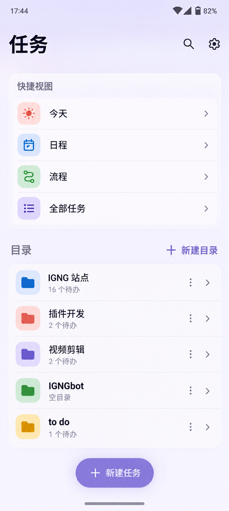

# TaskDock 安卓目录首页与 M3 Expressive 概念图

状态：2026-09-24 安卓端重构与视觉审阅迭代已完成。Round 3 子代理对可采信的虚拟机截图及 All Tasks 组件图复审后，没有剩余材料性 UI 修改意见。最新 API 35 All Tasks/目录整屏复验受 AVD/ADB 系统启动故障阻塞，不能宣称整套设备级验收通过；证据和边界见 [Round 3 报告](ANDROID_M3E_DIRECTORY_VM_EVIDENCE/round-3/README.md) 与 [Round 3 Review](ANDROID_M3E_DIRECTORY_VM_EVIDENCE/round-3/REVIEW.md)。历轮记录见 [ANDROID_M3E_DIRECTORY_VM_EVIDENCE](ANDROID_M3E_DIRECTORY_VM_EVIDENCE/)。

本文件按用户最新要求取代此前“四个底部一级目的地”的导航建议。[上一轮审阅](ANDROID_M3_EXPRESSIVE_UI_REPAIR_BRIEF.md)对列表层级、色彩、任务语义和验收边界的分析继续有效；其中保留底部 Dock、把“任务库/计划”作为底栏目的地的内容，以本文件为准。仓库早期 [Android M3 重构文档](ANDROID_MATERIAL3_REBUILD.md)里的四个一级目的地，也是旧阶段的设计决定。

## 概念图

| 图          | 用途                                                              | 文件                                                          |
| ----------- | ----------------------------------------------------------------- | ------------------------------------------------------------- |
| A：目录首页 | 冷启动后的信息架构、置顶快捷视图、目录树、设置入口、状态栏/手势区 | [taskdock-m3e-home.png](design/taskdock-m3e-home.png)         |
| B：目录内部 | 返回、任务状态、分组、快速新建和系统边缘                          | [taskdock-m3e-folder.png](design/taskdock-m3e-folder.png)     |
| C：日程     | 从快捷视图进入后的日期/事件层级、创建入口和系统边缘               | [taskdock-m3e-schedule.png](design/taskdock-m3e-schedule.png) |

三张图由内置 imagegen 生成，属于视觉概念，不是准确的 Android 系统截图或可直接照搬的 Compose 布局。图上的通知图标、时间、电量、任务数、日期、事件名和示例任务文案均是占位数据。图 B 的“25%”只能在真实已完成/总任务数据支持时出现；任务副文案中的“产品体验/技术维护”等也不是本项目已有字段，不得为匹配图片而新造标签或写入协议。图 A 的不同颜色文件夹底板仅表示轻量视觉变化，不代表文件夹已有颜色属性。系统状态图标、手势小白条及其形状由 Android 绘制，应用只负责其下方表面、对比度与安全距离。

## 设计前审阅：旧版 UI 差距（历史基线）

- 新截图 1—4 已比上一轮更清楚：任务库有目录概览，计划有“今天与接下来”，设置有账户摘要。但底部仍常驻“今日/任务库/计划/设置”四栏，任务目录是第二个目的地；空的“今日”先占据冷启动首屏。这是信息架构问题，不是增加圆角可以解决的。
- Microsoft To Do 参考图 5—7 展示的是“智能视图在前、目录列表为主体、进入目录看任务、设置在顶部/账户入口”的浏览路径。TaskDock 应吸收这一路径，但保留自身的日期、事件、流程、目录/任务/Placement 语义，不复制 Microsoft 图标、星标、提醒或品牌。
- 现有 [TaskDockApp.kt:31-97](../apps/mobile/android/app/src/main/java/com/devtodo/app/ui/TaskDockApp.kt#L31) 以 BottomNavScreens 判断一级页面、绘制 NavigationBar/NavigationRail，并以 Screen.Today 作为登录后默认路由；登录成功跳转同样指向 Today（[TaskDockApp.kt:129-139](../apps/mobile/android/app/src/main/java/com/devtodo/app/ui/TaskDockApp.kt#L129)）。
- [TreeScreen.kt:150-213](../apps/mobile/android/app/src/main/java/com/devtodo/app/ui/screens/TreeScreen.kt#L150) 仍把“目录/全部任务”塞进任务库页签。[PlanningScreen.kt:18-29](../apps/mobile/android/app/src/main/java/com/devtodo/app/ui/screens/PlanningScreen.kt#L18) 又把“日期与事件/流程”塞进计划页签。这与新要求的目录首页加置顶快捷视图不同。
- [MainActivity.kt:27-43](../apps/mobile/android/app/src/main/java/com/devtodo/app/MainActivity.kt#L27) 已调用 enableEdgeToEdge；但 [TaskDockApp.kt:55-64](../apps/mobile/android/app/src/main/java/com/devtodo/app/ui/TaskDockApp.kt#L55) 在整个根内容上施加 WindowInsets.safeDrawing，内层 Scaffold 又禁用自身 contentWindowInsets；页面顶栏也使用零 windowInsets。这个组合让主要内容退入系统栏以内，图中顶端与底端更像独立条带。这里只能确认布局所有权和截图效果；具体系统栏底色还需设备上检查。
- [Theme.kt:158-174](../apps/mobile/android/app/src/main/java/com/devtodo/app/ui/theme/Theme.kt#L158) 只按深浅模式切换系统栏图标明暗。它并未定义不同页面顶部色面延伸到状态栏、底部色面延伸到手势区时的关系。

## 应交给实现 AI 的导航契约

| 入口             | 页面及已有语义                                                        | 返回                            |
| ---------------- | --------------------------------------------------------------------- | ------------------------------- |
| 冷启动或登录成功 | 目录首页，即根目录视图；直接看到置顶快捷视图和当前根目录内容          | 根页再次返回由系统处理退出/后台 |
| 今天             | 现有 TodayV2Screen，展示今天安排的 Task/Placement                     | 回目录首页，保留原滚动位置      |
| 日程             | 现有日期与事件能力，即 TimeScreen；创建时保留日期/事件 Placement 语义 | 回目录首页                      |
| 流程             | 现有 WorkflowsV2Screen；流程与阶段、成员和排序功能保持                | 回目录首页                      |
| 全部任务         | 现有 AllTasksV2Screen 的搜索/筛选/任务列表，成为快捷视图直接入口      | 回目录首页                      |
| 某个目录         | 按 Folder ID 钻取子目录及混合排序的任务；根目录中的根任务继续可见     | 回上级目录，最终回首页          |
| 设置             | 顶栏齿轮或账户入口进入 SettingsScreen；归档中心仍从设置进入           | 回进入前的页面或首页            |

“置顶”指这些入口位于首页目录列表之前，打开应用即可看见；它们与目录内容一起滚动，不要固定一整块菜单长期占据半屏。手机界面不再显示底部四栏 Dock。中大屏可选择同一层级结构的自适应侧栏/抽屉，但不能把四栏底部导航换个位置后仍让目录退居第二级。

可沿用内部路由和 ViewModel，但不能仅将 startDestination 改为 Tree 就结束：需要把目录首页与“全部任务”页签拆开，并给日程、流程明确可直达的入口。保留搜索范围提示、目录定位参数、从日期/流程跳回目录并高亮任务的路径。登录、进程恢复和系统返回不得产生导航循环或丢失目录层级。保留创建任务时的目标语义：今天创建的是今天安排，选中日期创建的是该日期 Placement，目录内创建落在当前目录，流程中创建仍遵守现有业务规则。

## 视觉与交互规范

### 首页

图 A 的版式约束是：顶部标题“任务”与搜索/设置 → 紧凑的四个快捷视图 → “目录”及新建目录 → 根目录混合列表 → 单个新建任务主操作。目录必须是视觉主体；快捷视图使用一组相连的柔和容器，不做四张巨大的统计卡。根目录按现有状态/rank 契约呈现文件夹和根任务；图 A 只露出前五个文件夹是因为屏幕空间，并非要隐藏其他文件夹或根任务。

图 A 的文件夹彩色底板可以由固定、低饱和、稳定的展示规则产生，也可以统一用一个语义色；颜色不得代替状态文字，不增加数据字段。行菜单继续可访问，但其噪声低于标题。空目录与有待办目录有不同的辅助文案。主操作“新建任务”可以在短屏/大字体下变为页内按钮或紧凑 FAB，始终不能覆盖最后一条可操作行。

### 目录内部与快捷视图

图 B 展示返回/标题、简短目录摘要、状态分组、可直接完成/撤销的圆形控件和新建任务。目录内的步骤进度、任务副文案只能来自现有真实数据；不为匹配概念图新增星标、优先级、标签或虚构百分比。目录内应保持可快速扫描的列表密度，完成状态不只靠颜色传递。选择一个任务打开详情的原有路径不变。

图 C 说明“日程”是从首页直达的独立视图，日期与事件可在页面内分组，不需要再经过“计划”页签。DATE 的 localDate 是日历日期，展示时不要变成跨日时间戳；事件标题是用户数据。过去的空日期可收起但仍可访问。流程可按同一顶栏/系统边缘规则实现，保留阶段、排序、成员、创建和归档动作。

### M3 Expressive 的具体用法

页面用少量层级清楚的字阶和有目的的形状：页首宽松、快捷视图成组、目录列表连续、按钮饱满，避免每行一个大卡。基底和容器优先取 MaterialTheme 的 surface 与 surfaceContainer 色阶，强调色取对应 primary/secondary/tertiary 容器及其 on* 前景。动态色改变具体色值时，层级和对比度仍应成立。动效只用于进入目录、完成任务、切换快捷视图、展开/收起和 FAB 状态，不让全部列表持续弹跳。

## 顶部状态栏与底部手势区

这是必须单独验收的内容。应用应让页面背景或顶栏色面真实延伸到状态栏下方，让系统时间/信号图标处在同一视觉表面上；可点击的标题、搜索和设置按钮仍在状态栏与刘海安全区以下。底部页面背景应延伸至手势区，小白条所在位置不能突然变成另一块灰/白底栏；新建按钮和列表最后一项要避开 navigationBars、safeGestures 与 IME。三键导航可由系统施加半透明保护，不能为了匹配手势图稿破坏对比度。

源码层面要明确 Insets 的单一所有者，核对根节点、各页 Scaffold、TopAppBar、弹层与键盘的消费顺序，避免“全局 safeDrawing 一次 + 子页面再 padding 一次”或完全零 Insets。顶部和底部的系统元素不在 Compose 中手绘。概念图未复现用户截图里的黑色动态通知胶囊，它是系统/其他应用覆盖层，不属于 TaskDock UI。

官方依据：[Compose Edge-to-edge](https://developer.android.com/develop/ui/compose/system/setup-e2e)、[WindowInsets](https://developer.android.com/develop/ui/compose/system/insets)、[System bar protection](https://developer.android.com/develop/ui/compose/system/system-bars)、[Material 3 in Compose](https://developer.android.com/develop/ui/compose/designsystems/material3)。

## 虚拟机验收：哪些必须相似

| 必须与概念大体一致                                                            | 可随真实数据与系统变化                                |
| ----------------------------------------------------------------------------- | ----------------------------------------------------- |
| 冷启动进入目录首页，四个快捷视图在目录前，设置从顶部进入，手机无四栏底部 Dock | 状态栏图标、电量、时间和系统手势线由设备绘制          |
| 同一套标题、圆角层级、容器关系、目录密度和主要操作位置                        | 文件夹数、待办数、任务标题、事件名、日期与可见行数    |
| 顶部背景连续到状态栏，底部背景连续到手势区；触控不压住系统区                  | 动态色/深色下的实际色值；三键导航的系统对比保护       |
| 目录钻取、快捷视图直达、返回、创建与任务状态反馈清晰                          | 图 B 的装饰性进度环、演示用副文案；无真实数据时应省略 |

实现 AI 至少提交同一组真实数据的：首页、目录内部、今天、日程、流程、全部任务、设置的虚拟机截图，以及首页→目录→任务详情→返回、首页→快捷视图→返回、新建任务、搜索、完成/撤销的短录屏。分别检查浅/深主题、动态色开关、手势/三键导航、窄屏、横屏、200% 字体、IME 与 TalkBack。至少在用户实际设备系统版本或相近的 Android 15/16 虚拟机复核系统栏；已有 API 30 模拟器截图不能证明 Android 15/16 边到边表现。图稿与真实截图比较应以结构、层级、边缘衔接和可操作性为准，不按生成图的单个像素、假数据或系统图标打分。

## 可复用生图提示词

统一前缀，可交给 imagegen 继续做深色/横屏变体：

> Use case: ui-mockup. Create a realistic, implementation-oriented single-screen Android Material 3 Expressive concept for the original TaskDock To Do app. Tall 9:20 portrait, full-bleed opaque screen pixels, no phone frame. Light soft ivory and periwinkle tonal surfaces, clear Chinese typography, related rounded shapes, restrained small coral/blue/green accents, dense scan-friendly task lists, no Microsoft branding. App background continues seamlessly behind the real-looking Android status bar and gesture handle; interactive controls respect safe insets. No bottom four-tab dock, no black voids, no glassmorphism, no weather dashboard, no fake system overlay. Text must be legible and spelled exactly as specified.

首页后缀：

> Show the root directory as the launch screen. Top app bar: “任务”, search icon, settings gear. Compact grouped pinned smart views above the folder list: “今天”, “日程”, “流程”, “全部任务”. Then heading “目录”, small “新建目录” action and a continuous scannable list of folders “IGNG 站点”, “插件开发”, “视频剪辑”, “IGNGbot”, “to do”, with modest secondary counts. A single bottom “＋ 新建任务” action above the Android gesture region. No tab row and no bottom navigation.

目录内后缀：

> Show a directory named “IGNG 站点”, top back action, a compact summary, grouped “进行中” and “待办” tasks with circular complete controls, and one bottom “＋ 新建任务” action. Do not invent stars, priority or reminder fields. Keep text and actions clear at practical Android sizes; do not show a bottom dock.

日程后缀：

> Show a standalone “日程” view opened from the home smart views. Top back action; sections “今天”, “接下来”, “事件”; one calendar date with a task and one named event; a bottom “＋ 选择日期” action. Dates and events are visually distinct; bottom gesture area remains the same app surface; no bottom dock.

## 实现与视觉复审状态（2026-09-24）

- 安卓端已改为目录首页默认入口，四个快捷视图前置，手机端取消四栏底部导航；目录钻取、详情、设置、搜索、状态操作、创建入口和短屏/大字体内联操作已按本概念实施。
- Round 3 可采信的 API 35 全设备截图确认：首页快捷视图在目录之前，根目录末项标题、状态与行菜单完整露出且不被创建操作遮挡，见 [首页截图](ANDROID_M3E_DIRECTORY_VM_EVIDENCE/round-3/api35-directory-method-v2/device-files/ui-evidence/tasks-home.png) 与 [末项截图](ANDROID_M3E_DIRECTORY_VM_EVIDENCE/round-3/api35-directory-method-v2/device-files/ui-evidence/tasks-home-last-row.png)。
- Round 3 子代理没有提出新的材料性 UI 代码修改意见。历史 All Tasks Compose 层截图的组件结构也符合本概念，但其测试离线 Snackbar 遮挡了一行，且截图不含系统栏、没有当前源码版本标记，只作为结构审阅依据。
- 最新 APK 的 All Tasks/目录导航截图复验、短屏 200% 字体、横屏、动态色、IME 与 TalkBack 仍未完成。API 35 的 ddmlib 错读 API level、framework 服务回退，API 36 system_server Watchdog，以及 API 30 Lost network stack 均记录为模拟器环境阻塞；不视作应用断言失败，也不作为整套设备级签收证据。
